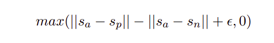

# Notes for paper

## BERT
BERT (Devlin et al., 2018) is a pre-trained transformer network (Vaswani et al., 2017), which set for various NLP tasks new state-of-the-art results. 

The input for BERT for sentence-pair regression consists of the two sentences, separated by a special [SEP] token. Multi-head attention over 12 (base-model) is applied and the output is passed to a simple regression function a, Feed Forward NN, to derive the final label.

A large disadvantage of the BERT network structure is that no independent sentence embeddings are computed, which makes it difficult to derive sentence embeddings from BERT.

## Sent-BERT

SBERT adds a pooling operation to the output of BERT to derive a fixed sized sentence embedding.

For our use case, we are using MEAN pooling Strategy.

In order to fine-tune BERT we create siamese and triplet networks (Schroff et al.,2015) to update the weights such that the produced sentence embeddings are semantically meaningful and can be compared with cosine-similarity.

We are using Siamese Network to train our model

In our old model , we utilized Regression Objective Function (ROF) . In ROF, The cosine similarity between the two sentence embeddings u and v is computed. We used Mean-Squared-Error loss as the objective function.

In out Current model, we are using Triplet Objective Function.

## Siamese Network And Triplet loss ( Ranking Loss )

### Siamese Network
A Siamese Neural Network is a class of neural network architectures that contain two or more identical subnetworks. ‘identical’ here means, they have the same configuration with the same parameters and weights. Parameter updating is mirrored across both sub-networks. It is used to find the similarity of the inputs by comparing its feature vectors, so these networks are used in many applications

### Ranking Loss
Given an anchor sentence a, a positive sentence p, and a negative sentence n, triplet loss tunes the network such that the distance between a and p is smaller than the distance between a and n.

</img>

Margin e ensures that sp is at least e closer to sa than sn.
